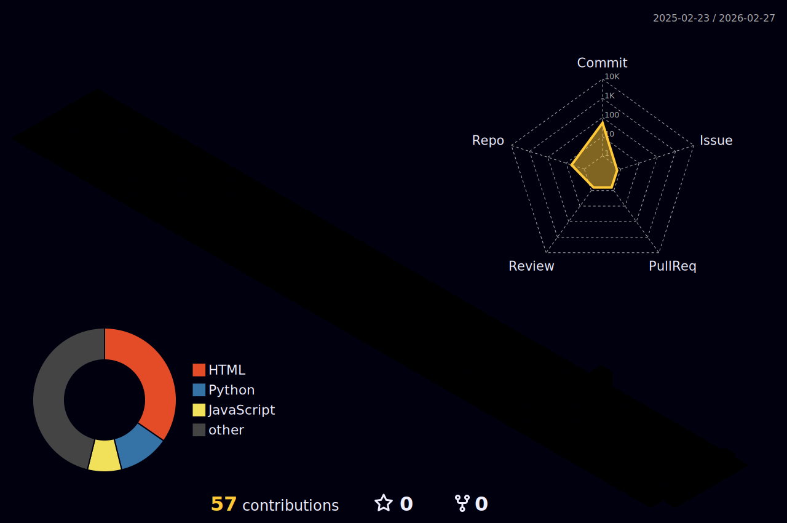

 

  

<picture>
  <source media="(prefers-color-scheme: dark)" srcset="https://raw.githubusercontent.com/NotFoundRyan/NotFoundRyan/output/github-snake-dark.svg" />
  <source media="(prefers-color-scheme: light)" srcset="https://raw.githubusercontent.com/NotFoundRyan/NotFoundRyan/output/github-snake.svg" />
  
</picture>

## Tech Stack

 

 

## GitHub Analytics

 

<!-- 基础统计（Shields.io） -->

  

<!-- 语言统计（Shields.io） -->

  

<!-- 贡献图 -->

## Trophies

 

## 3D Contribution

## Contact

  

